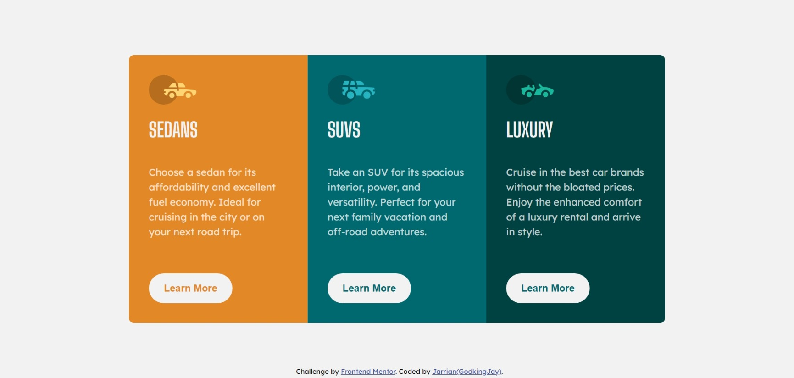

# Frontend Mentor - 3-column preview card component solution

This is a solution to the [3-column preview card component challenge on Frontend Mentor](https://www.frontendmentor.io/challenges/3column-preview-card-component-pH92eAR2-). Frontend Mentor challenges help you improve your coding skills by building realistic projects. 

## Table of contents

- [Overview](#overview)
  - [The challenge](#the-challenge)
  - [Screenshot](#screenshot)
  - [Links](#links)
- [My process](#my-process)
  - [Built with](#built-with)
- [Author](#author)

## Overview

### The challenge

Users should be able to:

- View the optimal layout depending on their device's screen size.
- See hover states for interactive elements.

### Screenshot

- Desktop

- Mobile

### Links

- Solution URL: ---> [LINK](https://www.frontendmentor.io/solutions/responsive-nft-preview-card-component-Qm0zDGNx3p)
- Live Site URL: ---> [LINK](https://godkingjay.github.io/frontendmentor.io_NFT-preview-card-component/)

## My process

### Built with

- Semantic HTML5 markup
- CSS custom properties
- Flexbox
- CSS Grid

## Author

- Frontend Mentor - [@godkingjay](https://www.frontendmentor.io/profile/godkingjay)
- Twitter - [@godking_jay](https://www.twitter.com/godking_jay)
